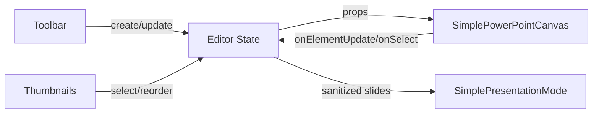

# GlassSlide

A modern, web‑based slide editor and presentation studio. GlassSlide helps you design beautiful slides quickly with an Apple‑grade UX, a canvas powered by Fabric.js, rich components (text, shapes, charts, tables, media), and a polished presentation experience with full‑screen playback and smooth animations.

---

## Why GlassSlide
- **Problem**: Traditional slide tools feel heavy, slow, and locked into desktop ecosystems. Real‑time editing in the browser often lacks precision and delightful UX.
- **Our Solution**: A fast, React + TypeScript editor with a declarative canvas, responsive UI, and focused workflows for creating professional decks in minutes.

---

## Feature Overview
- **Slide Editor**: Drag, align, and style elements with a pixel‑precise canvas.
- **Text**: Rich typography, alignment, line height, decoration, and font controls.
- **Shapes**: Rectangle, rounded rectangle, circle/ellipse, triangle, lines, arrows, and more with fill/border/opacity/rotation.
- **Charts**: Bar, line, pie (Chart.js via a thin wrapper) with themeable colors and editable datasets.
- **Tables**: Structured table element with themes, header rows, alternating backgrounds, padding and borders.
- **Media**: Image insertion with auto‑sizing, object‑fit controls and optional borders.
- **Templates**: Quick start themes/demos to bootstrap a presentation.
- **Thumbnails**: Live, synced slide thumbnails for fast navigation and reordering.
- **Presentation Mode**: Smooth transitions, keyboard/touch navigation, auto‑play, and full‑screen with edge‑to‑edge scaling and rounded corners.
- **Persistence**: Local storage save/load and project management helpers.

---

## UI/UX Highlights
- **Toolbar**: Context‑aware actions and compact controls (`src/components/editor/Toolbar.tsx`).
- **Properties Panel**: Clean editing surface with grouped controls (text, shapes, tables, etc.) (`src/components/editor/PropertiesPanel.tsx`).
- **Canvas**: High‑fidelity Fabric.js renderer with natural selection and transform handles.
- **Presentation Polish**: Subtle shadows, rounded slide corners, smooth easing with Framer Motion.
- **Keyboard Shortcuts**: Navigate slides, toggle fullscreen, play/pause, restart, and more.

---

## Technology Stack
- **React + TypeScript**: App architecture and type safety
- **Fabric.js**: Canvas drawing and interactive objects
- **shadcn/ui + Radix**: Accessible UI primitives
- **Framer Motion**: Polished animations and transitions
- **TailwindCSS**: Utility‑first styling
- **Zustand**: Lightweight, composable state management
- **Vite**: Blazing‑fast dev server and bundling

---

## File Structure
```
glassslide-studio/
  ├─ public/
  ├─ src/
  │  ├─ components/
  │  │  ├─ canvas/
  │  │  │  ├─ SimplePowerPointCanvas.tsx
  │  │  │  └─ ...
  │  │  ├─ editor/
  │  │  │  ├─ Toolbar.tsx
  │  │  │  ├─ PropertiesPanel.tsx
  │  │  │  ├─ SimplePresentationMode.tsx
  │  │  │  └─ ...
  │  │  └─ ui/ (shadcn components)
  │  ├─ hooks/
  │  │  ├─ usePresentationStore.ts
  │  │  └─ ...
  │  ├─ pages/
  │  │  ├─ Editor.tsx
  │  │  └─ PresentationMode.tsx
  │  ├─ utils/
  │  │  ├─ presentationValidator.ts
  │  │  └─ ...
  │  └─ types/
  ├─ index.html
  ├─ vite.config.ts
  └─ package.json (or equivalent)
```

---

## Installation
1. **Prerequisites**
   - Node.js 18+
   - pnpm (recommended) or yarn/npm
2. **Install dependencies**
```bash
# pnpm
pnpm install
# or
npm install
# or
yarn install
```

---

## Local Development
```bash
# start dev server
pnpm dev
# build for production
pnpm build
# preview production build
pnpm preview
```
- Dev server defaults to `http://localhost:5173` (Vite).

---

## Usage Guide
- **Create a deck** in the editor (`/`): add slides, drag elements, and style them via the properties panel.
- **Insert elements**:
  - Text, shapes, images from the toolbar.
  - Charts with editable datasets (bar/line/pie).
  - Tables with header rows and themes.
- **Reorder slides** using thumbnails. Rename or duplicate slides from the thumbnails panel.
- **Present** using the Present button; use keyboard shortcuts for full‑screen, auto‑play, and navigation.

---

## Component Architecture
- **Editor shell**: `src/pages/Editor.tsx`
  - Hosts toolbar, thumbnails, canvas, and properties panel.
- **Canvas**: `src/components/canvas/SimplePowerPointCanvas.tsx`
  - Fabric.js objects for text/shapes/images; emits updates to editor state.
- **Presentation**:
  - Simple: `src/components/editor/SimplePresentationMode.tsx`
  - Advanced: `src/pages/PresentationMode.tsx` (animated transitions, control overlay)
- **Panels**:
  - `Toolbar.tsx`: actions, project/title handling, image insertion
  - `PropertiesPanel.tsx`: element‑specific controls; shows shape name and chart type



---

## State Management (Zustand)
- **Editor state**: current slides array, current selection, undo/redo (local history hook), zoom.
- **Presentation store** (`usePresentationStore.ts`): playback (play/pause), current slide index, fullscreen, accessibility options, error handling.
- **Persistence**: localStorage bridges editor and presentation for seamless handoff.

---

## Canvas Rendering Workflow
- Elements are stored as serializable objects (position, size, styling, type‑specific props).
- Fabric.js creates corresponding objects on the canvas.
- Edits emit `onElementUpdate` to sync back to the slide model.
- Images auto‑size to safe defaults and preserve aspect ratio with optional border/border‑radius.

---

## Slide Thumbnails Sync
- Thumbnails derive from the same slide model to ensure WYSIWYG reflection.
- Reordering updates the slide array; selection updates the active canvas; deletion maintains a valid index.

---

## Tools Behavior
- **Layout**: Preset placeholder layouts (title/body) with smart alignment.
- **Shapes**: Fill/stroke/opacity/border radius, geometric variants; rotation and skew where applicable.
- **Text**: Font family/size/weight/style, transform, alignment (H/V), letter/line spacing, padding and borders.
- **Charts**: Types: bar/line/pie; datasets & labels editable; color palettes; rendered via Chart.js wrapper component.
- **Tables**: Rows/cols, header, alternating rows, padding; themes (`TABLE_THEMES`) with border and background presets.
- **Media**: Image insertion from local file with safe sizing and object fit.

---

## Responsive Behavior & Scaling Rules
- **Toolbar**: Compresses spacing and icon sizes on smaller screens; key labels hidden under `sm`.
- **Canvas Area**: Flexible center column; zoom preserved; scroll overflow for smaller viewports.
- **Right Properties Panel**: Fixed width (~280px); collapsible groups; remains scrollable.
- **Thumbnails**: Left rail (desktop) or top row (mobile) with horizontal scroll; live index highlight.
- **Presentation Mode**: Edge‑to‑edge scaler computes `min(viewportW/960, viewportH/540)`; rounded corners and shadow.

---

## Accessibility Notes
- UI primitives sourced from shadcn/ui (Radix underpinnings) for baseline a11y.
- Keyboard shortcuts: navigation, fullscreen, play/pause, restart; controls have `aria-label`s.
- High‑contrast backgrounds and focus states in control overlays.

---

## Cross‑Browser Support
- Target evergreen browsers: Chrome, Edge, Firefox, Safari.
- Fullscreen API usage with vendor fallbacks where applicable.
- Tailwind/modern CSS features guarded by reasonable fallbacks.

---

## Performance Optimizations
- Vite + esbuild for fast HMR and builds.
- Virtualized/conditional rendering in thumbnails and properties panel groups.
- Debounced updates from Fabric.js to state.
- Lazy‑loading of non‑critical modules (e.g., exporter).
- Memoized selectors and derived props for re‑render minimization.

---

## Roadmap
- **Collaboration**: Multi‑user presence and comments.
- **Exporter**: PDF/image export and enhanced PPTX fidelity.
- **Animations**: Element‑level animations and transitions.
- **Templates**: Theme marketplace and template editor.
- **Assets**: Media library with uploads, cropping, and filters.
- **Integrations**: Cloud storage providers and auth.

---

## Contribution Guidelines
- **Branching**: feature/..., fix/..., chore/...
- **Commits**: Conventional Commits (`feat:`, `fix:`, `docs:`, etc.).
- **Code Style**: TypeScript strictness; prefer functional components and hooks; keep components focused.
- **UI**: Reuse shadcn/ui components; keep Tailwind classes readable; avoid inline styles unless necessary.
- **Testing**: Add unit tests for core logic and hooks when possible.
- **PRs**: Include a clear description, screenshots for UI changes, and a test plan.

---

## Getting Help
- Open an issue with steps to reproduce and environment details.
- Include screenshots or a short clip for UI glitches.

Enjoy building with GlassSlide! ✨
